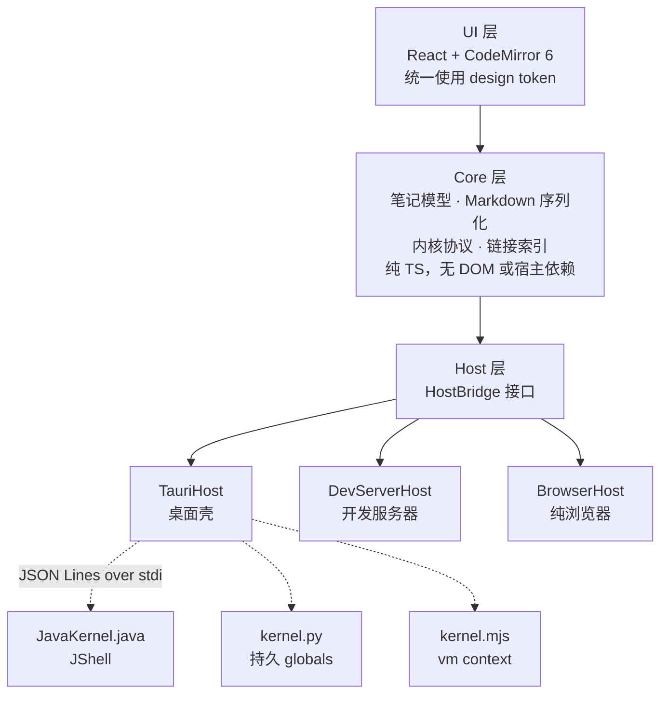

<div align="center">


# NoteX

**在笔记中写代码，用运行结果验证思路。**

用 Markdown 记录思路，在同一篇笔记中编写和运行 Java、Python、JavaScript。  
笔记保存在本地，可用 Git 管理版本，也可用其他编辑器继续编辑。


</div>

---

## 文字、代码与结果，放在同一篇笔记里

NoteX 是一款支持运行代码的本地笔记应用。你可以一边写下思路，一边运行代码，并在代码下方查看结果。

笔记以普通的 `.md` 文件保存：

````markdown
# 采样分布

用 numpy 生成一组样本，查看分布形状。

```python {id=c1}
import numpy as np, matplotlib.pyplot as plt
rng = np.random.default_rng(42)
plt.hist(rng.normal(170, 7, 2000), bins=45)
```
````

同一份 Markdown 文件，可以在 GitHub 上查看代码高亮，在 VS Code 中编辑，也可以在 NoteX 中运行代码。

### 粘贴网页内容和图片

将网页内容粘贴到文本单元格时，NoteX 会自动将其转换为 Markdown，保留标题、加粗、列表、表格和代码块。图片会下载到笔记所在目录的 `.assets/` 文件夹，并以相对路径引用；也支持直接粘贴截图。

笔记和图片可以一起纳入 Git 管理。保留它们的相对位置，即可在其他支持 Markdown 图片预览的编辑器中查看。

### 展示代码与运行代码

NoteX 用代码围栏上的 `{id=…}` 区分可执行代码单元格与普通代码示例。文本单元格中的代码块仅用于展示；需要运行时，可通过右键菜单选择「转为代码」，NoteX 会自动移除围栏，将其转换为代码单元格。

首次打开不含此标记的外部 Markdown 文件时，NoteX 会将能够识别的代码块作为可执行单元格，保存时补上标记。

## 三种语言，一篇笔记

每个代码单元格都可以独立选择语言。点击左上角的 `JAVA`、`PY` 或 `JS` 标签即可切换，切换时会保留已有代码。

每种语言使用独立的执行内核。同一种语言的代码单元格共享变量，不同语言之间不共享变量。

| 语言 | 冷启动 | 中断响应 | 补全来源 |
|---|---|---|---|
| Java | ~0.9 s | 6 ms | JShell 语义补全 |
| Python | ~20 ms | 1 ms | 优先使用 jedi，未安装时使用 rlcompleter |
| JavaScript | ~20 ms | 1 ms | 运行时上下文反射 |

三个内核均以单个源码文件分发，使用本机的 `java`、`python3` 或 `node` 直接启动，无需额外安装内核组件。

### 根据上下文补全代码

Java 补全基于 JShell 的 `SourceCodeAnalysis`，能识别变量及其类型。

在上一个代码块中声明变量，下一个代码块就能接着用。输入 `.`，即可查看带类型信息的方法补全。

### 在代码下方查看运行结果

- **Python**：matplotlib 图表自动显示，无需显式返回，行为与 Jupyter 的 inline 后端一致。
- **Java**：集合和映射渲染为表格，`BufferedImage` 渲染为图片。

### 在笔记中声明 Java 依赖

通过 `//DEPS` 声明依赖，即可在代码中使用：

```java
//DEPS org.apache.commons:commons-lang3:3.14.0

import org.apache.commons.lang3.StringUtils;
StringUtils.reverse("NoteX")
```

已安装 Maven 时，自动解析传递依赖；未安装时，只下载显式声明的 jar。

## 链接与搜索

支持 wiki 链接和标准 Markdown 链接，也可以直接指向某个小节：

```markdown
[[数据分布图]]              链接到笔记，输入 [[ 可触发补全
[[数据分布图#箱线图]]       链接到笔记中的小节
[看看图表](数据分布图.md)   标准 Markdown 链接
```

- **创建笔记**：目标笔记不存在时，链接显示为虚线，点击即可创建。
- **查看引用**：笔记末尾的反向链接面板会列出引用当前笔记的其他笔记。
- **更新链接**：笔记重命名或移动后，其他笔记中指向它的链接会自动更新。
- **打开外链**：外部链接在系统浏览器中打开。

按 `⌘K` 打开搜索面板，可搜索整个笔记库的标题和正文。未输入关键词时，面板会列出最近更新的笔记。使用 `↑↓` 选择，按 `↩` 打开。

## 本地文件与编辑恢复

笔记正文保存在 Markdown 文件中，运行结果单独保存在同目录的隐藏文件里。

```text
~/NoteX/
├── 工作/
│   ├── 周报.md
│   └── 项目A/
│       └── 设计文档.md
├── 数据分布图.md
├── .数据分布图.outputs.json    ← 运行结果，隐藏文件
└── .assets/                    ← 粘贴进来的图片，正文里用相对路径引用
```

你可以用 Git 管理版本，也可以随时换一个编辑器继续写。

在 Finder 或其他编辑器中修改文件后，NoteX 会自动读取最新内容。如果同一篇笔记在 NoteX 和外部编辑器中都有修改，应用会提示你选择保留的版本，避免直接覆盖。

删除的笔记和文件夹会移入系统废纸篓，可从中恢复。

在编辑框内，按 `⌘Z` 可逐步撤销文字修改；焦点位于编辑框外时，可撤销整段编辑，以及单元格删除、移动、转换、语言切换和粘贴等操作。按 `⇧⌘Z` 可重做。撤销编辑不会清除后续执行产生的运行结果。

## 快速开始

启动桌面应用：

```bash
pnpm install
pnpm desktop
```

在浏览器中启动：

```bash
pnpm dev          # 打开 http://localhost:5173
```

构建桌面应用：

```bash
pnpm desktop:build   # → src-tauri/target/release/bundle/macos/NoteX.app
```

### 按需安装语言环境

只需安装你要使用的语言环境，缺少某一种不会影响其他语言的代码块。

| 语言 | 最低版本 | 说明 |
|---|---|---|
| Java | JDK 17 | 必须是 JDK，JRE 不含 `jdk.jshell` |
| Python | 3.8 | 自动识别 venv 与 conda |
| JavaScript | Node 18 | |

首次启动会按以下顺序查找运行时：

1. 手动指定的路径
2. 环境变量
3. `PATH`
4. sdkman / pyenv / conda / nvm / volta 等版本管理器的常见位置

未找到对应的语言环境时，点击运行按钮会显示适用于当前平台的安装命令。你也可以在设置中下载 NoteX 提供的运行时：

- **Python 科学计算版**：包含 numpy、pandas、matplotlib 和 scipy。
- **Java**：使用 jlink 精简的 JDK 17 运行时。
- **JavaScript**：Node 20。

这些运行时安装在 `~/.notex/runtimes`，不会修改系统中的语言环境。启动时会隔离本机的 `PYTHONPATH`、conda、`JAVA_TOOL_OPTIONS` 等环境配置，减少相互影响。

运行时安装包和清单维护在 [imelonkid/notex-runtimes](https://github.com/imelonkid/notex-runtimes)。下载使用系统代理；无法在线下载时，也可以手动下载安装包，再通过「选择本地包」安装。

检测到多个语言环境时，设置中会列出可用选项。切换环境后，需要重启对应内核才能生效，侧栏会显示圆点提示。

## 主题与显示设置

主题通过 JSON 文件定义，支持自定义**颜色、字体、字重和标题比例**。界面尺寸、间距和布局由应用统一管理，不随主题改变。

```json
{
  "notex-theme": 1,
  "id": "nord",
  "name": "Nord Dark",
  "appearance": "dark",
  "colors": { "bg": "#2e3440", "fg": "#eceff4", "syn-keyword": "#81a1c1" }
}
```

未填写的字段会继承对应浅色或深色默认主题的配置，因此只需定义想要修改的部分。将主题文件放入 `~/.notex/themes/` 后，即可在设置中选择。修改主题文件后，切回应用即可看到更新。

启用「跟随系统」后，可以分别指定浅色模式和深色模式使用的主题。

字号和显示密度单独设置，不随主题切换而改变。显示密度提供紧凑、标准、宽松三档，用于调整行距、段距和单元格间距。在设置面板中修改选项后，点击「保存」生效。

- [主题说明](docs/THEME.md)：原则、格式、继承与校验规则
- [字段参考](docs/THEME-REFERENCE.md)：全部可写字段与默认值
- [theme.schema.json](docs/theme.schema.json)：在编辑器里补全和校验
- [示例主题](examples/themes/ink.json)

## 架构

UI 负责交互，Core 负责笔记与执行逻辑，Host 提供文件和进程能力。三种语言分别交给各自的内核执行。



各层遵循以下约束：

1. **UI 不直接操作文件和进程**：通过 Core 工作，可在纯浏览器中运行。
2. **Core 不依赖宿主**：更换宿主时，无需修改业务代码。
3. **内核无需构建，也无额外依赖**：以源码文件分发，由本机运行时直接启动。

### 内核协议

应用与内核通过标准输入输出交换 JSON Lines 消息。每条协议消息以 RS（U+001E）开头，其余行按普通 stdout 处理，避免意外的 `print` 干扰通信。

以下省略 RS 前缀：

```jsonc
{"id":"r1","op":"execute","code":"1 + 1"}
{"id":"r1","type":"result","data":{"text/plain":"2"}}
{"id":"r1","type":"done","status":"ok","durationMs":12}
```

无需启动界面，也可以单独测试内核：

```bash
node kernels/test-kernel.mjs java     # 也接受 python / js
```

## 测试

```bash
pnpm test
```

该命令会执行类型检查，并测试 Markdown 序列化与反序列化、链接解析与索引、路径安全、主题协议、内核中断升级、运行时隔离与清单校验、富文本粘贴和撤销栈。同时执行三个语言内核的冒烟测试和富输出测试。

重点覆盖以下边界：

- Markdown 与 ipynb 的往返一致性
- 路径越界防护和危险协议拦截
- 跨目录同名笔记的链接解析，以及重命名后的链接更新
- 中断升级仅作用于目标请求，发送 SIGINT 不会终止 Java 内核
- 运行时清单的校验（id、版本、sha256、下载地址）
- ISO8601 转换的闰年边界

Rust 侧测试单独运行：

```bash
pnpm test:rust
```

## 目录结构

```text
src/
  core/         模型 · Markdown 序列化 · 内核协议 · 链接索引 · 运行时注册表
  host/         HostBridge 接口及三个宿主适配器
  runtimes/     各语言的探测、启动与安装引导
  ui/           React 组件 · design token · 主题 · CodeMirror 集成
server/         Vite 插件，开发期提供 spawn / exec / 文件能力
kernels/        三个零依赖内核脚本
runtimes/       内置运行时包的构建与发布脚本（正式流水线在 notex-runtimes 仓库）
src-tauri/      桌面壳，以 Rust 实现文件与进程能力
themes/         主题包
assets/         标识源文件与应用图标底稿
public/         favicon 等随页面分发的静态文件
docs/           架构设计与方案
```

## 已知限制

- 目前仅在 macOS 上验证。Windows 的中断功能仍需适配信号机制。
- 三种语言的内核独立运行，不共享变量。
- 不支持标准输入，`Scanner` 和 `input()` 会挂起。
- 每种语言同一时刻只能使用一个运行时，切换后需重启内核。
- 移动笔记到其他文件夹时，`.assets/` 中的图片不会自动迁移。
- 目录最多支持三级。

## 设计文档

- [架构设计](docs/ARCHITECTURE.md)
- [全局评审与修补记录](docs/CR-全局评审.md)
- [主题](docs/THEME.md)
- [主题边界调研](docs/RESEARCH-主题边界.md)
- [目录与超链方案](docs/PROPOSAL-目录与超链.md)
- [cell 操作重构](docs/PROPOSAL-cell操作重构.md)
- [执行序号调研](docs/RESEARCH-执行序号.md)

## 许可

[MIT](LICENSE)