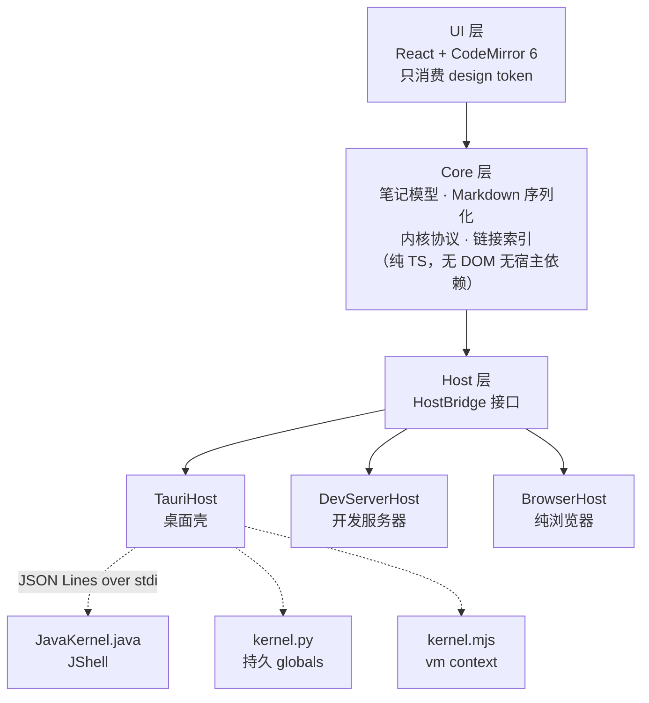

<div align="center">

# NoteX

**一个本地优先的可执行笔记本。用 Markdown 写，代码就在页面里跑。**

Java · Python · JavaScript 三种语言，同一篇笔记里随意混用。
笔记以纯 Markdown 存在你自己的目录里，能用 Git 管，能用任何编辑器打开。


</div>

---

## 这是什么

Jupyter 很好，但它的笔记是一坨 JSON，Git 里看不了 diff，也没法用别的编辑器改。
Obsidian 很好，但它不能跑代码。

NoteX 想把这两件事合到一起：

````markdown
# 采样分布

用 numpy 生成两组样本，看看形状差异。

```python {id=c1}
import numpy as np, matplotlib.pyplot as plt
rng = np.random.default_rng(42)
plt.hist(rng.normal(170, 7, 2000), bins=45)
```
````

上面这段就是磁盘上 `.md` 文件的真实内容。代码块是标准的围栏块，
在 GitHub 上能高亮，在 VS Code 里能编辑，在 NoteX 里能运行。

## 特性

### 三种语言，一篇笔记

每个代码块左上角有 `JAVA` `PY` `JS` 三个标签，点一下就切换，源码不会丢。
每种语言一个独立内核，变量跨代码块保留。

| | 冷启动 | 中断响应 | 补全来源 |
|---|---|---|---|
| Java | ~0.9 s | 6 ms | JShell 语义补全 |
| Python | ~20 ms | 1 ms | jedi，没装则 rlcompleter |
| JavaScript | ~20 ms | 1 ms | 反射运行时上下文 |

内核是三个零依赖的单文件脚本，用你本机已有的 `java` / `python3` / `node` 直接启动，
不需要额外安装任何东西。没装某种运行环境时，运行按钮会给出对应平台的安装命令。

### 真正的语义补全

Java 走 JShell 的 `SourceCodeAnalysis`，在一个代码块里声明的变量，
下一个代码块里输入 `.` 就能补出它的方法，带类型信息。这不是关键字匹配。

### 图表与富输出

matplotlib 的图自动显示，不需要写返回值，行为和 Jupyter 的 inline 后端一致。
Java 的集合和映射会渲染成表格，`BufferedImage` 渲染成图片。

### Java 依赖直接写在笔记里

```java
//DEPS org.apache.commons:commons-lang3:3.14.0

import org.apache.commons.lang3.StringUtils;
StringUtils.reverse("NoteX")
```

装了 Maven 就做完整的传递依赖解析，没装则直接下载显式声明的 jar。

### 笔记之间可以互相引用

```markdown
[[数据分布图]]              wiki 写法，敲 [[ 会弹出补全
[[数据分布图#箱线图]]       跳到目标笔记的某个小节
[看看图表](数据分布图.md)   标准 Markdown 写法
```

- 指向不存在笔记的链接显示为虚线，点一下就能创建那篇笔记
- 笔记末尾有反向链接面板，列出谁引用了这一篇
- 外部链接交给系统浏览器，应用窗口不会被网页顶掉

### 你的笔记就是你的文件

```
~/NoteX/
├── 工作/
│   ├── 周报.md
│   └── 项目A/
│       └── 设计文档.md
├── 数据分布图.md
└── .数据分布图.outputs.json    ← 运行结果，隐藏文件
```

Markdown 是正本，运行结果存在同目录的隐藏旁车文件里。
在 Finder 或别的编辑器里改了文件，应用会自动读回来；
两边同时改过则停下来问你保留哪一份，绝不静默覆盖。

## 快速开始

桌面应用：

```bash
pnpm install
pnpm desktop
```

或者在浏览器里跑：

```bash
pnpm dev          # 打开 http://localhost:5173
```

出安装包：

```bash
pnpm desktop:build   # → src-tauri/target/release/bundle/macos/NoteX.app
```

首次启动会自动探测本机运行时，探测顺序是：手动指定的路径、环境变量、
`PATH`、再到 sdkman / pyenv / conda / nvm / volta 这些版本管理器的常见位置。

### 运行时要求

| 语言 | 最低版本 | 说明 |
|---|---|---|
| Java | JDK 17 | 必须是 JDK，JRE 不含 `jdk.jshell` |
| Python | 3.8 | 自动识别 venv 与 conda |
| JavaScript | Node 18 | |

三者都不是必需的，缺哪个只影响哪种语言的代码块。

## 架构



三条约束贯穿始终：

1. **UI 不碰进程和文件**，只通过 Core 工作，因此能在纯浏览器里跑
2. **Core 不依赖任何宿主**，换壳不改业务代码
3. **内核零构建零依赖**，是源码文件而不是需要分发的二进制

### 内核协议

JSON Lines over stdio，每条协议消息以 RS（U+001E）开头。
不以它开头的行一律当作漏网的 stdout，所以内核里意外的 `print` 不会让通信崩掉。

```jsonc
{"id":"r1","op":"execute","code":"1 + 1"}
{"id":"r1","type":"result","data":{"text/plain":"2"}}
{"id":"r1","type":"done","status":"ok","durationMs":12}
```

单独测一个内核，不用开界面：

```bash
node kernels/test-kernel.mjs java     # 也接受 python / js
```

## 主题

组件不写死任何颜色，全部走 CSS 变量。主题包是一个 JSON，只需提供想改的 token：

```jsonc
{
  "id": "nord",
  "name": "Nord Dark",
  "appearance": "dark",
  "tokens": { "bg": "#2e3440", "fg": "#eceff4", "syn-keyword": "#81a1c1" }
}
```

放进项目的 `themes/` 或用户的 `~/.notex/themes/` 即自动加载。
CodeMirror 的语法高亮和 Markdown 里的代码块共用同一组 `--nx-syn-*` 变量，
所以三处配色永远一致。

## 测试

```bash
pnpm test
```

依次跑类型检查、序列化往返、链接解析、路径安全、链接索引，以及三个内核的
冒烟测试与富输出测试。Rust 侧另有 `pnpm test:rust`。

覆盖的都是容易出错又不容易发现的地方：Markdown 与 ipynb 的往返一致性、
路径越界防护、危险协议拦截、跨目录的链接消歧、手写的 ISO8601 转换在闰年边界。

## 目录结构

```
src/
  core/         模型 · Markdown 序列化 · 内核协议 · 链接索引 · 运行时注册表
  host/         HostBridge 接口 + 三个宿主适配器
  runtimes/     各语言的探测、启动、安装引导
  ui/           React 组件 · design token · 主题 · CodeMirror 集成
server/         Vite 插件，开发期提供 spawn / exec / 文件能力
kernels/        三个内核脚本，零依赖
src-tauri/      桌面壳，文件与进程能力的 Rust 实现
themes/         主题包
docs/           架构设计与方案
```

## 已知限制

- 目前只在 macOS 上验证过。Windows 的信号语义不同，中断需要另做适配。
- 三个内核相互独立，不共享变量。这是刻意的简化。
- 不支持标准输入，`Scanner` 和 `input()` 会挂起。
- 一种语言只能同时用一个版本，多版本切换尚未实现。
- 目录层级限制为三级。

## 设计文档

- [架构设计](docs/ARCHITECTURE.md)
- [目录与超链方案](docs/PROPOSAL-目录与超链.md)
