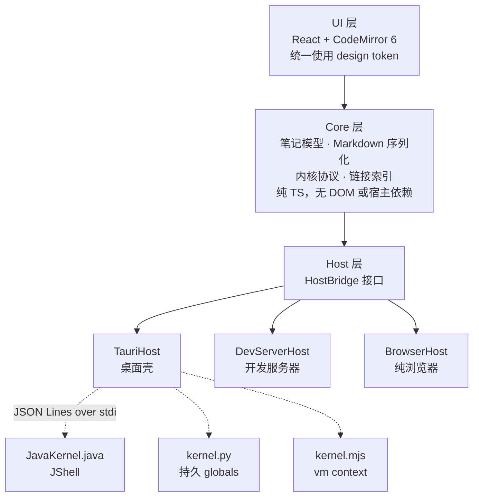

<div align="center">


# NoteX

**代码即笔记，笔记可运行。**

用 Markdown 记录思考，在同一篇笔记里运行 Java、Python 和 JavaScript。  
文件保存在本地，可用 Git 管理，也可用任何编辑器打开。


</div>

---

## 写下思路，运行验证

NoteX 是一个本地优先的可执行笔记本。文字、代码和结果放在一起，从记录思路到运行验证，都在同一篇笔记里完成。

磁盘上的笔记就是普通的 `.md` 文件：

````markdown
# 采样分布

用 numpy 生成一组样本，查看分布形状。

```python {id=c1}
import numpy as np, matplotlib.pyplot as plt
rng = np.random.default_rng(42)
plt.hist(rng.normal(170, 7, 2000), bins=45)
```
````

同一个代码块，在 GitHub 上能高亮，在 VS Code 里能编辑，在 NoteX 里能运行。

## 三种语言，一篇笔记

每个代码块都可以选择 `JAVA`、`PY` 或 `JS`。点击左上角的标签即可切换，已有源码会保留。

每种语言有独立内核：同一种语言的变量跨代码块保留，不同语言之间互不共享。

| 语言 | 冷启动 | 中断响应 | 补全来源 |
|---|---|---|---|
| Java | ~0.9 s | 6 ms | JShell 语义补全 |
| Python | ~20 ms | 1 ms | 优先使用 jedi，未安装时使用 rlcompleter |
| JavaScript | ~20 ms | 1 ms | 运行时上下文反射 |

三个内核都是零依赖的单文件脚本，直接使用本机的 `java` / `python3` / `node` 启动，无需额外安装内核组件。

### 补全跟得上上下文

Java 补全基于 JShell 的 `SourceCodeAnalysis`，能识别变量及其类型。

在上一个代码块中声明变量，下一个代码块就能接着用。输入 `.`，即可查看带类型信息的方法补全。

### 运行结果，就地呈现

- **Python**：matplotlib 图表自动显示，无需显式返回，行为与 Jupyter 的 inline 后端一致。
- **Java**：集合和映射渲染为表格，`BufferedImage` 渲染为图片。

### Java 依赖，写进笔记

通过 `//DEPS` 声明依赖，即可在代码中使用：

```java
//DEPS org.apache.commons:commons-lang3:3.14.0

import org.apache.commons.lang3.StringUtils;
StringUtils.reverse("NoteX")
```

已安装 Maven 时，自动解析传递依赖；未安装时，只下载显式声明的 jar。

## 笔记相连，思路相通

支持 wiki 链接和标准 Markdown 链接，也可以直接指向某个小节：

```markdown
[[数据分布图]]              链接到笔记，输入 [[ 可触发补全
[[数据分布图#箱线图]]       链接到笔记中的小节
[看看图表](数据分布图.md)   标准 Markdown 链接
```

- **边写边建**：目标笔记不存在时，链接显示为虚线，点击即可创建。
- **回看引用**：笔记末尾的反向链接面板会列出谁引用了这一篇。
- **打开外链**：外部链接交给系统浏览器，不打断当前笔记。

## 文件在本地，选择在你

笔记正文保存在 Markdown 文件中，运行结果单独保存在同目录的隐藏文件里。

```text
~/NoteX/
├── 工作/
│   ├── 周报.md
│   └── 项目A/
│       └── 设计文档.md
├── 数据分布图.md
└── .数据分布图.outputs.json    ← 运行结果，隐藏文件
```

你可以用 Git 管理版本，也可以随时换一个编辑器继续写。

在 Finder 或其他编辑器中修改文件后，NoteX 会自动读取更新。如果应用内外都改过，会提示你选择保留哪一份，不会静默覆盖。

## 快速开始

启动桌面应用：

```bash
pnpm install
pnpm desktop
```

在浏览器中启动：

```bash
pnpm dev          # 打开 http://localhost:5173
```

构建桌面应用：

```bash
pnpm desktop:build   # → src-tauri/target/release/bundle/macos/NoteX.app
```

### 按需安装语言环境

只需安装你要使用的语言环境，缺少某一种不会影响其他语言的代码块。

| 语言 | 最低版本 | 说明 |
|---|---|---|
| Java | JDK 17 | 必须是 JDK，JRE 不含 `jdk.jshell` |
| Python | 3.8 | 自动识别 venv 与 conda |
| JavaScript | Node 18 | |

首次启动会按以下顺序查找运行时：

1. 手动指定的路径
2. 环境变量
3. `PATH`
4. sdkman / pyenv / conda / nvm / volta 等版本管理器的常见位置

找不到对应环境时，运行按钮会提示当前平台的安装命令。

## 换个主题，继续写

界面颜色统一使用 CSS 变量。一个 JSON 文件就是一个主题包，只需填写想修改的 token：

```jsonc
{
  "id": "nord",
  "name": "Nord Dark",
  "appearance": "dark",
  "tokens": { "bg": "#2e3440", "fg": "#eceff4", "syn-keyword": "#81a1c1" }
}
```

放入项目的 `themes/` 或用户的 `~/.notex/themes/`，应用会自动加载。

CodeMirror 与 Markdown 代码块共用 `--nx-syn-*` 语法配色变量，编辑和阅读时保持一致。

## 架构

UI 负责交互，Core 负责笔记与执行逻辑，Host 提供文件和进程能力。三种语言分别交给各自的内核执行。



三条设计约束：

1. **UI 不直接操作文件和进程**：通过 Core 工作，可在纯浏览器中运行。
2. **Core 不依赖宿主**：更换宿主时，无需修改业务代码。
3. **内核无需构建，也无额外依赖**：以源码文件分发，由本机运行时直接启动。

### 内核协议

应用与内核通过标准输入输出交换 JSON Lines 消息。每条协议消息以 RS（U+001E）开头，其余行按普通 stdout 处理，避免意外的 `print` 干扰通信。

以下省略 RS 前缀：

```jsonc
{"id":"r1","op":"execute","code":"1 + 1"}
{"id":"r1","type":"result","data":{"text/plain":"2"}}
{"id":"r1","type":"done","status":"ok","durationMs":12}
```

无需启动界面，也可以单独测试内核：

```bash
node kernels/test-kernel.mjs java     # 也接受 python / js
```

## 测试

```bash
pnpm test
```

依次执行类型检查、序列化往返、链接解析、路径安全、链接索引，以及三个内核的冒烟测试和富输出测试。

重点覆盖以下边界：

- Markdown 与 ipynb 的往返一致性
- 路径越界防护和危险协议拦截
- 跨目录链接的消歧
- ISO8601 转换的闰年边界

Rust 侧测试单独运行：

```bash
pnpm test:rust
```

## 目录结构

```text
src/
  core/         模型 · Markdown 序列化 · 内核协议 · 链接索引 · 运行时注册表
  host/         HostBridge 接口及三个宿主适配器
  runtimes/     各语言的探测、启动与安装引导
  ui/           React 组件 · design token · 主题 · CodeMirror 集成
server/         Vite 插件，开发期提供 spawn / exec / 文件能力
kernels/        三个零依赖内核脚本
src-tauri/      桌面壳，以 Rust 实现文件与进程能力
themes/         主题包
assets/         标识源文件与应用图标底稿
public/         favicon 等随页面分发的静态文件
docs/           架构设计与方案
```

## 已知限制

- 目前仅在 macOS 上验证。Windows 的中断功能仍需适配信号机制。
- 三种语言的内核独立运行，不共享变量。
- 不支持标准输入，`Scanner` 和 `input()` 会挂起。
- 每种语言同时只能使用一个版本，暂不支持多版本切换。
- 目录最多支持三级。

## 设计文档

- [架构设计](docs/ARCHITECTURE.md)
- [目录与超链方案](docs/PROPOSAL-目录与超链.md)
- [cell 操作重构](docs/PROPOSAL-cell操作重构.md)
- [执行序号调研](docs/RESEARCH-执行序号.md)
